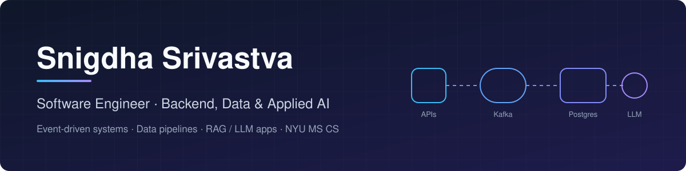

  

  
  
  

## 👋 About me

I'm a **Software Engineer with 5+ years of experience** building production systems end to end: event-driven backends, data pipelines and LLM / RAG applications. I've integrated them into real business workflows in regulated domains like **financial services, banking and healthcare**. I have an **M.S. in Computer Science from NYU** (GPA 3.9).

- 🏦 **Now:** Software Engineer at **Principal Financial Group**, building Kafka / Spring Boot services for retirement, insurance and investment platforms
- 🩺 **Before:** ML Engineer Intern at **Capital Rx** (HIPAA), Software Engineer at **Flipkart** and **DXC Technology**
- 🎯 **Interests:** distributed systems, data platforms, applied AI and customer-facing integrations

## 📈 Impact highlights

| ⚙️ Backend & distributed systems | 📊 Data engineering | 🤖 ML & applied AI |
|---|---|---|
| **18,000+ events/min** on Kafka pipelines | ETL / ELT pipelines feeding analytics and reporting | RAG over clinical, policy and support knowledge |
| **1.2M+ daily transactions** on Java 21 / Spring Boot | Data synced across **6+ enterprise systems** (SAP, MuleSoft, WMS) | OCR pipeline handling **1,000+ documents/week**, **~85% less** manual review |
| **99.9% availability** at 3,000+ req/min peak | Anomaly detection over **6M+ financial records** | MLflow / Azure ML evaluation and deployment |
| MTTR cut from **78 to 38 min** | Near-real-time reporting with Spring Batch | LangGraph + Claude / Bedrock workflows |

## 🛠️ Tech stack

**Languages** 

**Backend & streaming** 

**Data stores** 

**AI / ML** 

**Cloud & DevOps** 

**Frontend** 

**Observability** 

## 🚀 Featured projects

### 💸 [ledger-stream](https://github.com/SnigdhaSrivastva/ledger-stream) &nbsp;
Event-driven account ledger. A REST API publishes credits and debits to Kafka, partitioned by account, and consumers apply them to Postgres **exactly once and in order**, with idempotency keys, retries, a dead-letter topic for poison messages and overdraft protection. 11 tests on an embedded Kafka broker cover redelivery, concurrency and failure paths.
`Java 21` `Spring Boot` `Kafka` `PostgreSQL` `Flyway` `Docker`

### 🏙️ [nyc311-pipeline](https://github.com/SnigdhaSrivastva/nyc311-pipeline) &nbsp; 
Incremental ELT over **live NYC 311 data** (~10k requests a day), run daily on GitHub Actions: watermark + lookback extraction with retries, pydantic validation that keeps rejects with reasons, Arrow-batch upserts into DuckDB (~30k rows/s), analytics marts, and data-quality gates that hold the watermark on failure.
`Python` `DuckDB` `PyArrow` `Pydantic` `mypy strict` `GitHub Actions`

### 🔎 [ROS2 RAG Platform](https://github.com/SnigdhaSrivastva/ros2-rag-platform) &nbsp;
Retrieval-augmented Q&A over ROS2 / Nav2 / MoveIt2 / Gazebo docs. Idempotent crawler → MongoDB → chunking + embeddings → Qdrant → FastAPI `/ask` with source citations. Unit-tested and CI-checked.
`Python` `FastAPI` `Qdrant` `MongoDB` `Docker` · *team project*

### 🗓️ [Reservo: Transaction-Safe Reservations](https://github.com/SnigdhaSrivastva/reservo) &nbsp;
Booking backend where many users compete for limited slots. Atomic capacity holds, claim-by-delete confirmation, idempotency keys, hold expiry, FIFO waitlist and live WebSocket updates. Multi-threaded tests prove a slot is never oversold.
`Java 21` `Jetty` `JDBC` `PostgreSQL / H2` `WebSocket` `JUnit 5` · *team project*

### ✉️ [Mail Client Components](https://github.com/SnigdhaSrivastva/mail-client-components) &nbsp;
Component-based Python workspace: abstract client contracts, Gmail and Trello implementations, a FastAPI service with a generated OpenAPI client, and adapters. I worked on test coverage, CI, lint and type safety: 137 tests, ruff and mypy all clean.
`Python` `FastAPI` `OpenAPI` `aiohttp` `pytest` `mypy` · *team project*

### 🧠 [CIFAR-10 Shake-Shake ResNet](https://github.com/SnigdhaSrivastva/cifar10-shakeshake-resnet)
Shake-Shake ResNet-26 written from scratch in PyTorch with a custom autograd function, AutoAugment, Mixup / CutMix and label smoothing. **93.6% test accuracy**.
`PyTorch` `Computer Vision` `Deep Learning`

### 🕵️ [Deepfake Detection System](https://github.com/SnigdhaSrivastva/Deepface-Detection-System)
Django web app that flags deepfake **images** (fine-tuned Vision Transformer) and **audio** (VGG16 on mel-spectrograms), with user accounts.
`Django` `PyTorch` `ViT` `librosa` · *team project*

### 🚶 [Campus SafeWalk](https://github.com/SnigdhaSrivastva/campus-safewalk) &nbsp;[**▶ Live demo**](https://snigdhasrivastva.github.io/campus-safewalk/)
Interactive mobile prototype of a campus safety app: live map routing with route preferences, guardian sharing, session countdown and one-tap SOS. Built from paper prototypes and user-flow research.
`JavaScript` `Leaflet` `OpenStreetMap` `UX / HCI`

### 📬 [Job-Search Pipeline: Case Study](https://github.com/SnigdhaSrivastva/job-search-pipeline-case-study)
My job search as a data pipeline: **41.8k postings** scored by a local-model + LLM cascade for **$11** total, resumes tailored only from a verified fact bank, eligibility and visa-sponsorship filtering, and reply emails fed back into ranking. Extensions I built on a private base system.
`Python` `Playwright` `OpenAI` `scikit-learn` · *case study*

### 🏀 [NBA Rookie Contract Manager](https://github.com/SnigdhaSrivastva/nba-rookie-contract-ml)
Two-stage classifier that predicts contract-extension candidates from rookie stats under severe class imbalance (SMOTE, boosted SVM, bagged Random Forest).
`scikit-learn` `imbalanced-learn` `pandas` · *team project*

## 🎓 Education

- **M.S. Computer Science**, New York University · GPA 3.9 / 4.0
- **B.Tech Electronics & Communication**, GGSIP University · GPA 3.78 / 4.0

---

<i>Most of my professional work lives in private company repositories. Happy to walk through architecture and design decisions.</i>

